<h2> Étape 1 : Créez un répertoire </h2>

 La première étape consiste à créer un répertoire pour contenir notre environnement, ouvrez votre terminal et lancez la commande suivante :   

<em> sudo mkdir web_dev </em>

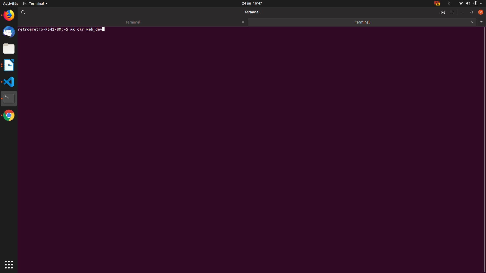

 Bref, vous avez un dossier super ! 

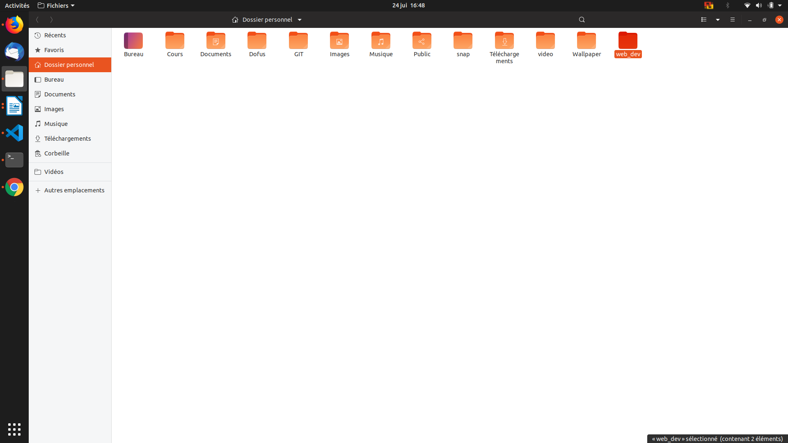

<h2> Étape 2 : Créez un fichier docker-compose </h2>

 Pour la seconde étape rendez vous dans votre dossier web_dev, ensuite créez un fichier nommé <em>"docker-compose.yml"</em>

 Pour ce faire vous pouvez tapez la commande suivante dans votre terminal :   

<em>touch docker-compose.yml</em>

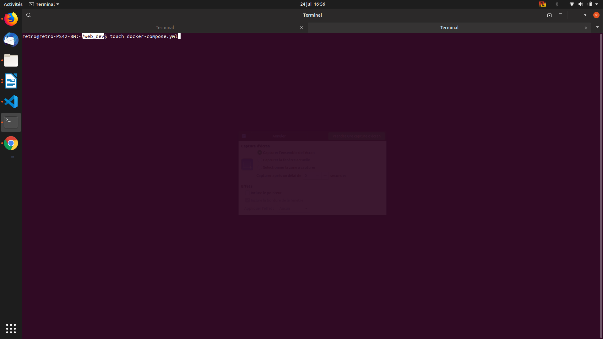
 
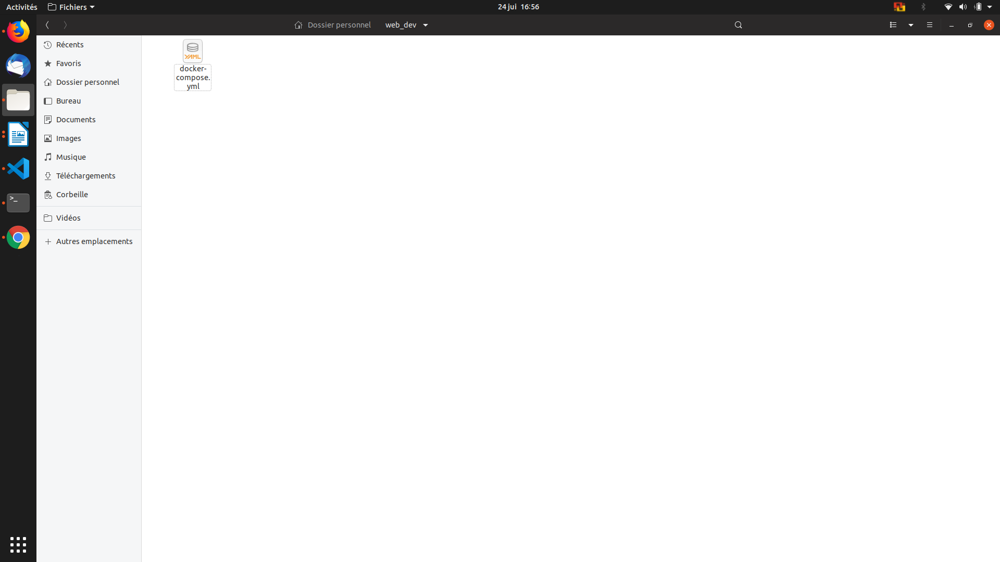

 Vous pouvez ensuite ouvrir ce fichier depuis votre éditeur de texte ou avec vim avec la commande suivante :   

<em> vim docker-compose.yml </em>

   

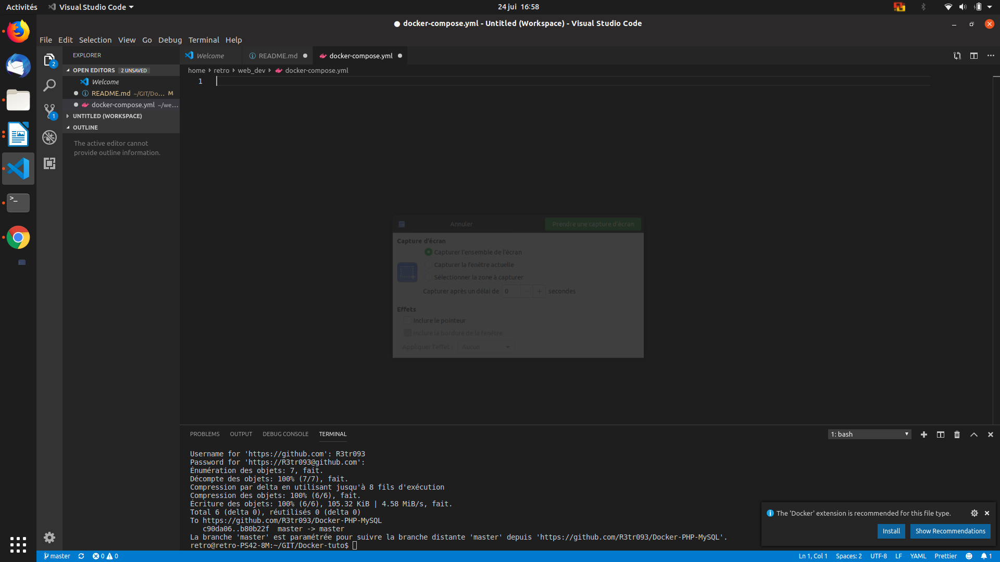

 Que vous ayez choisis vim ou votre éditeur de texte le but c'est de mettre du texte, recopier dans ce fichier le code ci-dessous : 

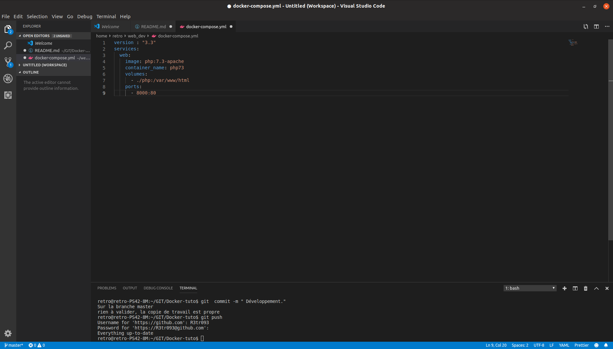   

 Une fois que vous avez écrit le code dans votre fichier retourner avec votre terminal dans votre dossier web_dev, il ne vous reste plus qu'une commande pour terminer cette étape :   

<em> sudo docker-compose up </em>

 Cette commande devrait se terminer ainsi : 

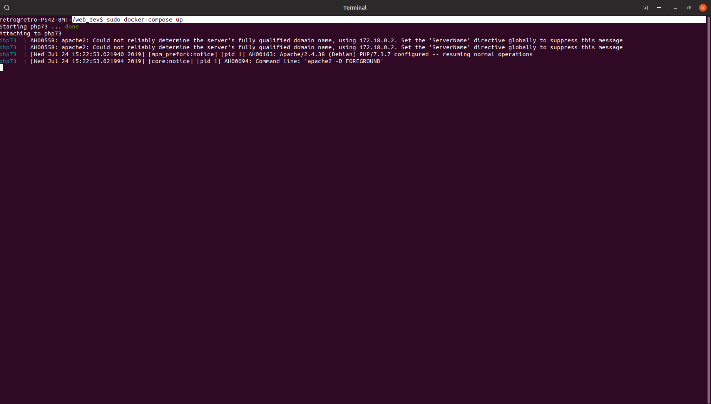

 Les fichiers contenant du code seront conservés dans le dossier " example " du repository. 

 Si tout s'est passé comme prévu, vous pouvez déjà lancez votre navigateur web à l'adresse suivante :   

<a href="http://localhost:8000/">http://localhost:8000/ </a>

 Vous devriez voir une page similaire à celle-ci. 

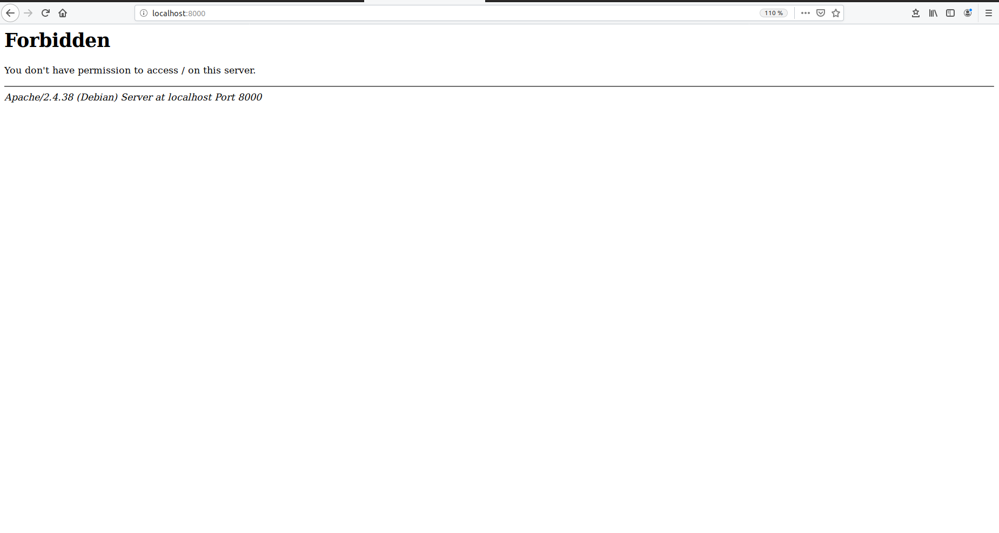

 Pas de panique tout va bien, passons à la 3iéme étape. 

<h2>Étape 3 : Autorisez l’accès au serveur.</h2>

 Dans votre terminal votre conteneur qui porte le joli nom de php73 est entrain de tourner, pour continuer il va falloir l'arrêtez. 

 Faîtes ctrl + c dans votre terminal et le conteneur devrait s'arrêtez, afin qu'on puisse modifier quelques fichiers 

 Rendez vous dans votre dossier web_dev afin de constater qu'un dossier php est apparu ! 

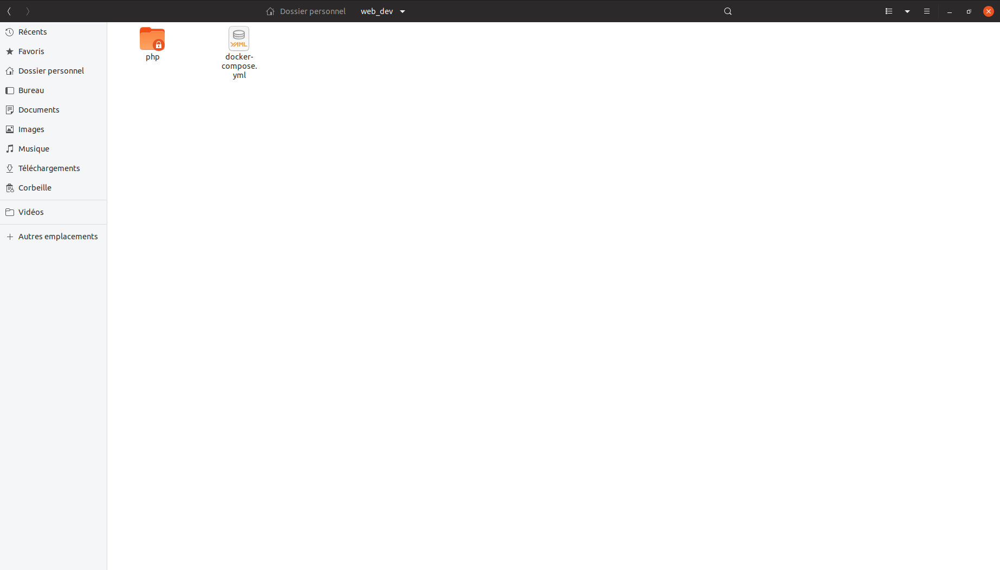

 Positionner vous dans ce dossier afin de procéder au instructions suivantes, nous allons créer un fichier index.php 

<em> sudo touch index.php </em>

  

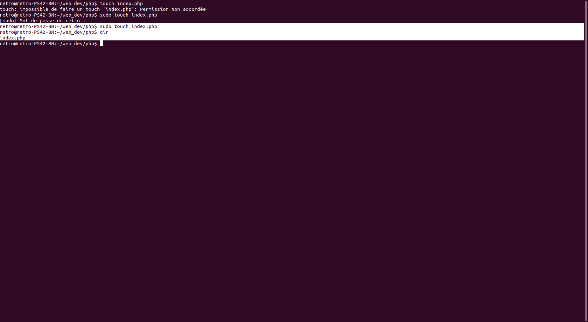

Obtenez les permissions sur le dossier PHP avec la commande suivante.

 Dans cette commande <em> " retro " </em> est mon nom d'utilisateur système remplacez donc ceci par votre nom d'utilisateur, cette commande doit être lancez depuis votre dossier web_dev, si cela ne fonctionne pas entrez sudo avant toutes vos commandes.

<em> sudo chown retro:retro php/ -R </em>

 Maintenant nous pouvons retourner dans notre dossier php afin de mettre du code dans notre fichier index.php 

 Ouvrez votre fichier afin d'y écrire le code suivant. 

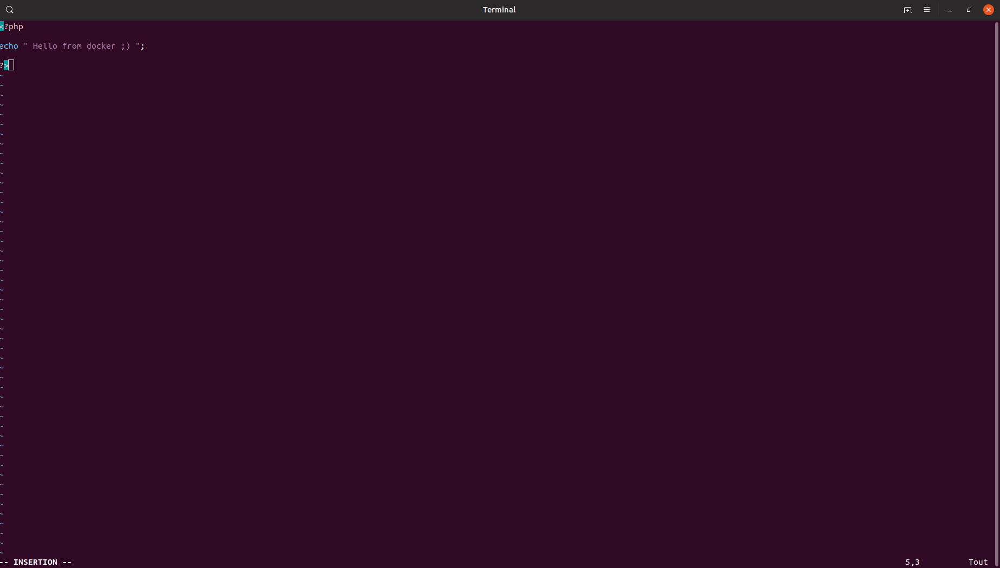

 Maintenant lancez votre conteneur avec la commande : 

<em> sudo docker start php73 </em> 

 Vous pouvez de nouveau ouvrir votre navigateur web sur l'adresse <a href="http://localhost:8000/">http://localhost:8000/ </a>, mais cette fois vous aurez votre " hello from docker " 

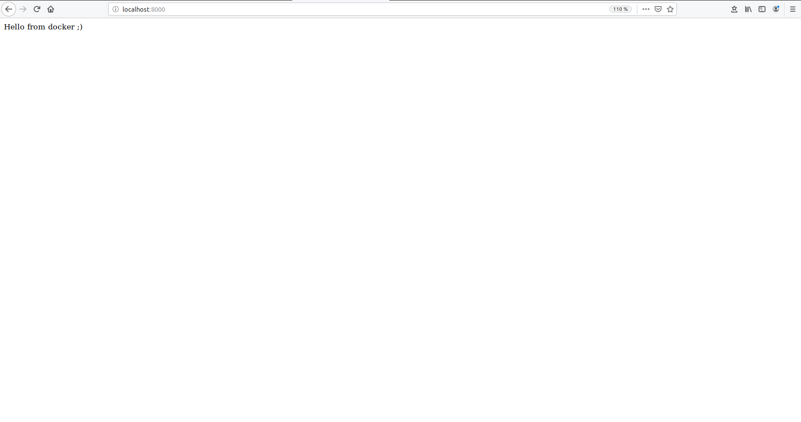

 Si vous êtes arrivé jusqu'ici avec le résultat attendu, vous avez un serveur apache qui fait tourner du php version 7.3 

Courage, il ne reste plus que la base de donnée. 

<h2> Étape 4 : Créez une base de donnée </h2>

Place vous dans le dossier php de votre dossier web_dev 

<em> cd web_dev/php </em>

 Lancez la commande vim Dockerfile et insérez le code suivant : 

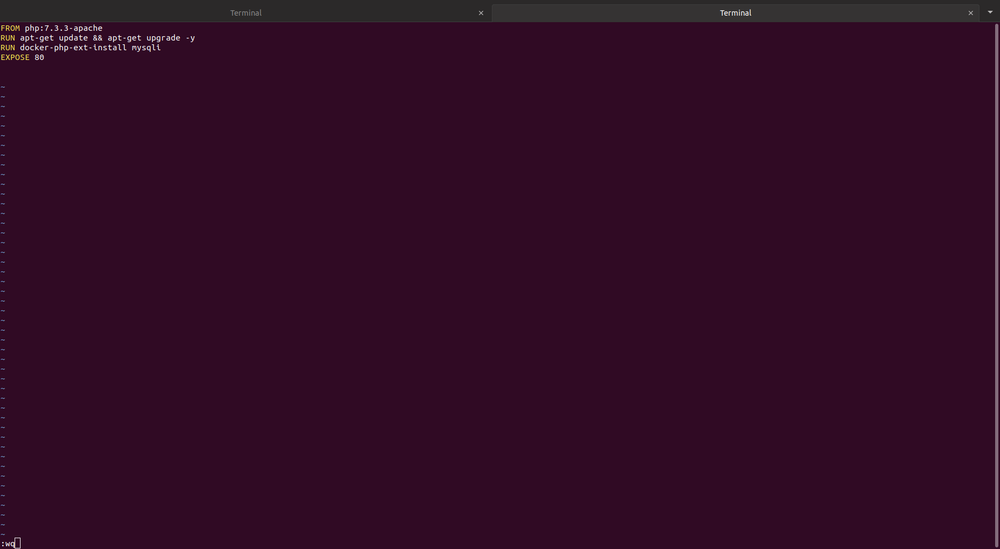

 Ensuite retourner dans votre dossier web_dev afin d'apporter quelques modifications au fichier docker-compose.yml 

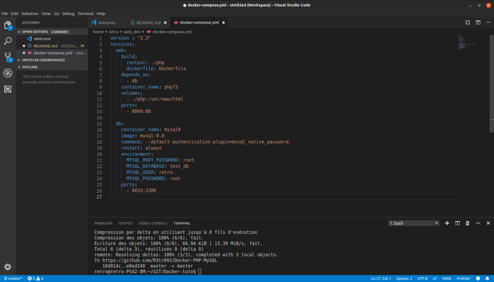
  

 Vous pouvez remplacer les champs : 

        MYSQL_ROOT_PASSWORD: root
       MYSQL_DATABASE: test_db
       MYSQL_USER: retro
       MYSQL_PASSWORD: root 

 Dans ce cas, indiquez les valeurs que vous souhaitez comme mot de passe, nom d'utilisateurs, etc... 

 Un petit coup de sudo docker-compose up 

<em> sudo docker-compose up </em>

 Maintenant nous dévons écrire un petit script php pour vérifier si on peut connecter notre base de donnée. 

 Rendez vous donc dans le dossier php, et modifiez le fichier index.php avec le code suivant. 

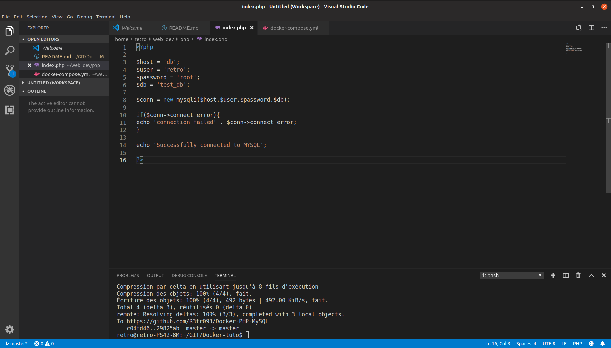

 Depuis votre dossier web-dev lancez à nouveau la commande sudo docker-compose -up vous devriez avoir ceci comme résultat.

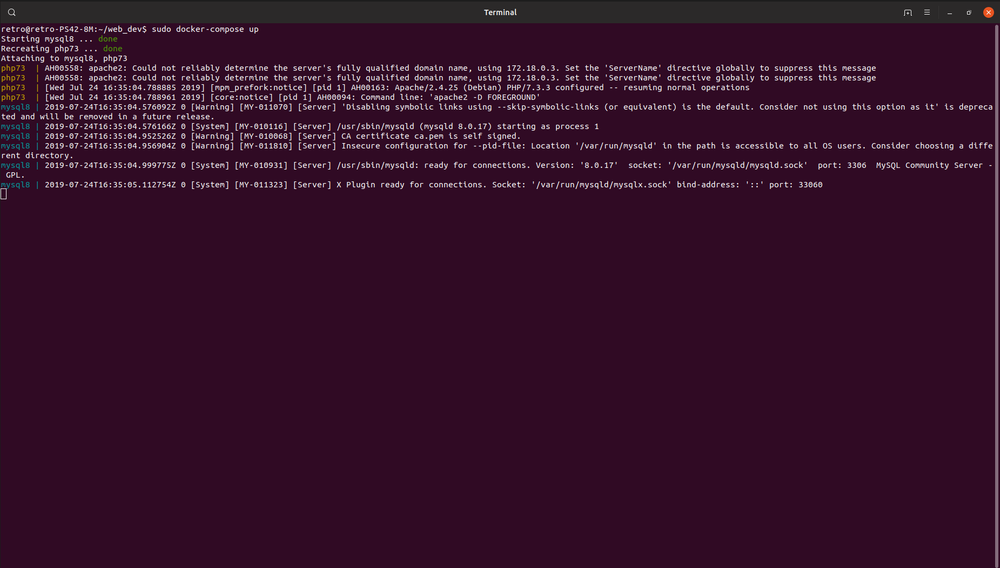

Ouvrez votre navigateur à l’adresse  <a href="http://localhost:8000/">http://localhost:8000/ </a>, et vérifier la connexion.

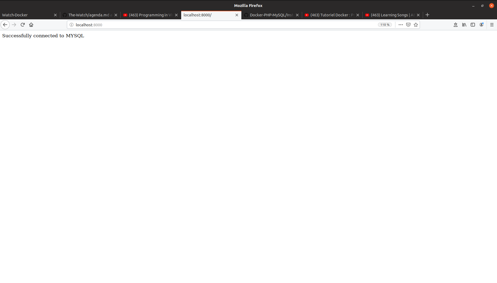

 Je vais maintenant vous montrez comment accéder a votre terminal MySQL. 

 Ouvrez un terminal et exécutez le code ci-dessous. 

<em> sudo docker exec -it mysql8 /bin/bash </em>

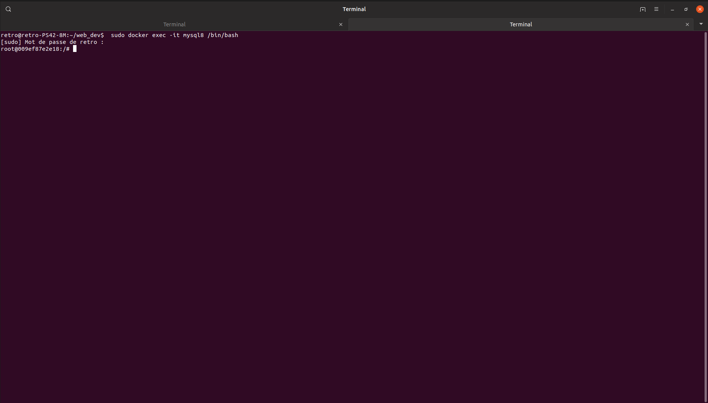

 Maintenant vous allez avoir besoin du nom d'utilisateur et du mot de passe que nous avons configuré pour la prochaine étape. 

 Lancez la commande ci-dessous. 

<em>mysql -uretro -proot</em>

 mysql suivi du flag -u directement suivi de votre nom d'utilisateur, et un flag -p directement suivi de votre mot de passe.

<em> Dans mon cas : mysql -uretro -proot </em>

  
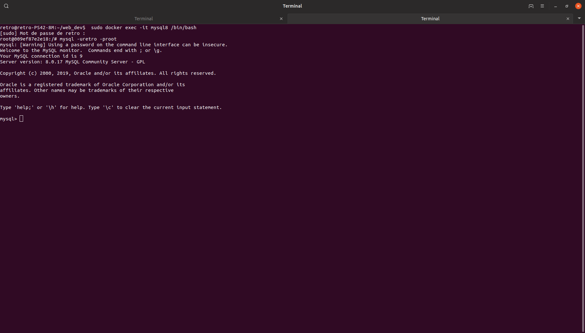

 Vous pouvez vérifier votre base de donnée avec la commande suivante.

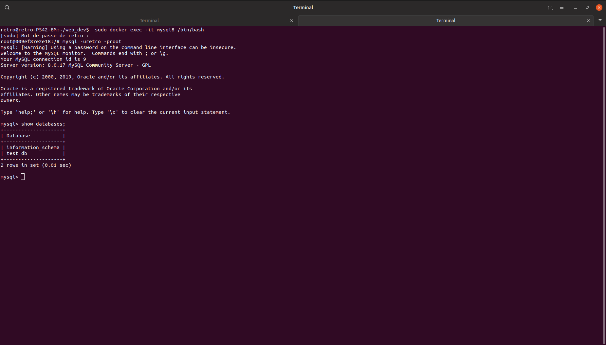

 Vous disposez d'un conteneur qui vous fait tourner apache, php 7.3 et MySQL, vous l'allumez, le supprimer, le copier, le téléchargez en un clin d'oeil car il pése 400mb et vous pouvez le partagez à tout vos collaborateurs.

